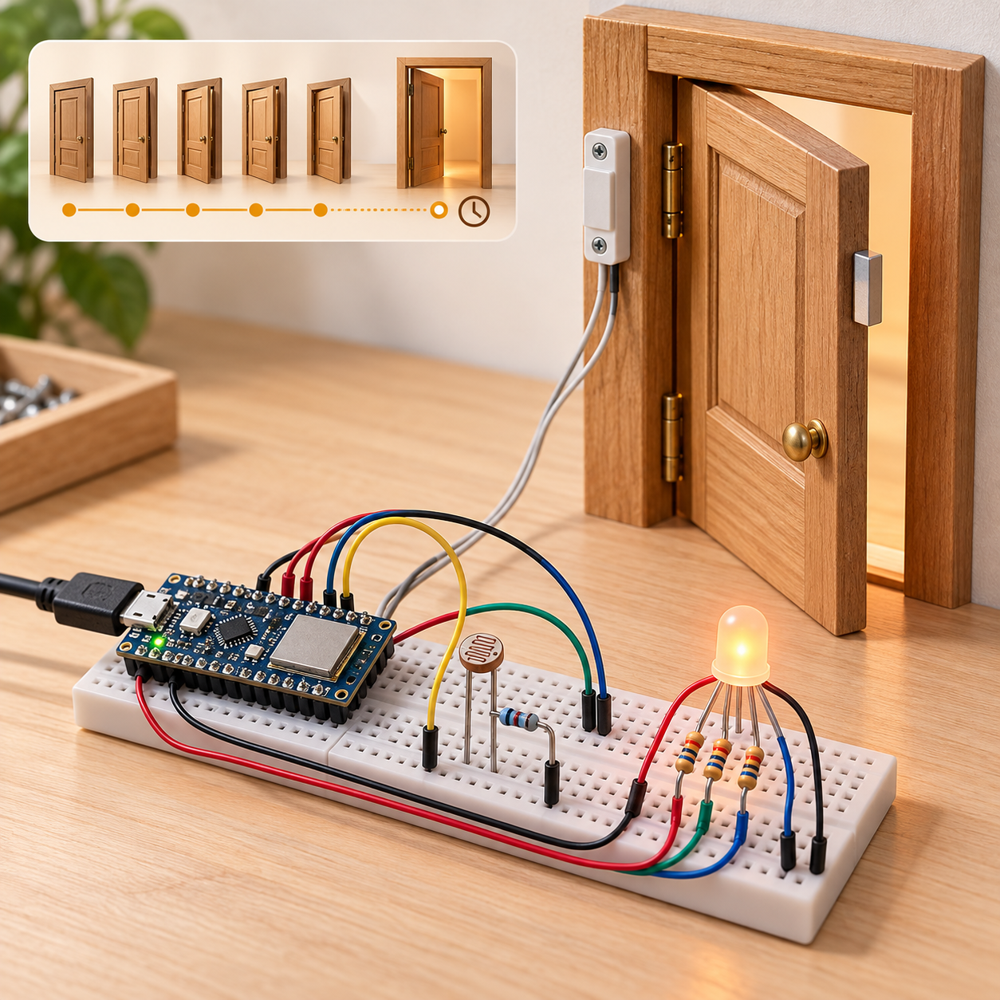

# Smart Entryway Predictive Maintenance
A local educational maintenance monitor for **Arduino Nano 33 IoT**. A magnetic door contact counts cycles, an LDR reports ambient light, and an RGB LED shows healthy/dark/service states. “Predictive maintenance” here is a transparent **rule-based reminder**, not machine learning or a diagnosis of wear.



## Objectives and features
Learn switch debounce, event counting, rollover-safe timing and service thresholds. Reject contact bounce for 50ms; count closed-to-open transitions; warn after 1000 cycles or 30 seconds continuously open; refuse counter reset while open. Serial telemetry works without Wi-Fi or accounts.

## Architecture and platform
The Nano samples the inputs about every 10ms and executes [the shared policy](firmware/maintenance.h). Output uses PWM RGB channels; JSON prints every two seconds. [Architecture](docs/architecture.md) and [editable wiring SVG](docs/circuit-diagram.svg) describe the same circuit. Nano I/O is **3.3V**, although USB power is 5V. Its Wi-Fi radio is unused.

## Bill of materials
| Quantity | Item |
|---:|---|
| 1 | Arduino Nano 33 IoT and USB data cable |
| 1 | Magnetic reed contact, closed when magnet/door is closed, plus magnet |
| 1 | LDR photoresistor |
| 1 | 10kΩ divider resistor |
| 1 | Common-cathode four-pin RGB LED |
| 3 | 330Ω LED resistors |
| 1 each | Breadboard and jumper set |

## Prerequisites and exact pin map
Install Python 3.12 and PlatformIO 6.1.18; use a USB data cable. Identify LED pinout from its datasheet. No external power supply is needed.
| Nano pin | Connection | Electrical role |
|---|---|---|
| 3V3 | LDR first leg | 3.3V rail |
| A0 | LDR second leg and 10kΩ to GND | 10-bit ADC; 0–1023 |
| D2 | Reed first terminal; second to GND | INPUT_PULLUP; LOW closed/HIGH open |
| D5 | 330Ω to red anode | PWM |
| D6 | 330Ω to green anode | PWM |
| D9 | 330Ω to blue anode | PWM |
| GND | LED common cathode, divider and contact | Common return |

## Circuit, wiring and assembly
[The circuit](docs/circuit-diagram.svg) is authoritative. Disconnect USB before wiring. Mount the magnet so the contact closes with the door shut; confirm continuity. Build the LDR divider exactly as above (more light usually raises A0). Give every LED anode a separate resistor; common cathode goes to GND. Inspect for shorts before USB connection. Use a miniature demonstration door, not a security installation.

## Setup and flashing
```sh
python -m pip install platformio==6.1.18
pio run -e nano_33_iot
pio run -e nano_33_iot -t upload
pio device monitor -b 115200
```
If upload fails, double-tap the board reset button to enter its bootloader and select the enumerated USB port. Firmware is [here](firmware/smart-entryway-predictive-maintenance/smart-entryway-predictive-maintenance.ino).

## Configuration and usage
Defaults in maintenance.h: debounce 50ms, service count 1000, open duration 30000ms, darkness ADC below 150. Adjust only after characterizing the contact and light divider; thresholds are demonstration values. The initial door state is accepted without adding a cycle. Open and close the door, then hold it open for 30 seconds. Green means healthy; blue dark; amber service; red invalid ADC (host-injected values outside 0–1023). A disconnected contact looks open, not a separately diagnosed wiring fault. Send newline-terminated `RESET` at 115200 after closing the door to clear the cycle reminder. A currently open door refuses reset.

## Telemetry, data formats and expected output
[Sample JSONL](sample-data/telemetry.jsonl) has one object per line: `ms` unsigned uptime in milliseconds (wraps), `open` boolean, `cycles` saturating unsigned count, `light_adc` raw ADC, and `state` healthy/dark/service/invalid. Example:
```json
{"ms":32000,"open":true,"cycles":1,"light_adc":500,"state":"service"}
```
USB RESET responses are plain text and should be filtered separately by JSON consumers. Counts reset on reboot; there is no wall clock or flash persistence. Service takes priority over darkness.

## Actual tests and validation
[Run results](docs/validation-results.md) record cloud evidence. CI runs meaningful C++ host tests, Python image transport tests, repository validators, PNG/SVG/link/MIT/credential checks and an actual Nano target build. [Hardware test plan](docs/test-plan.md) is provided. Physical hardware, ADC calibration and door installation have **not** been tested.

## Troubleshooting
No serial output: select 115200, correct USB port and data cable. Door always open: check contact polarity, magnet alignment and GND; internal pull-up requires no 5V. Dark state in daylight: check divider orientation and tune threshold. Wrong colors: identify the common cathode and anode order. Service persists: close the door then RESET, or reboot; an open-door warning reappears after 30s.

## Limitations and safety
The light sensor does not measure mechanical health. These rules cannot predict failures, protect an entryway or replace maintenance inspections. Long-open can reflect normal use. All state is volatile; short noise pulses under 50ms are intentionally ignored. An ADC rail value is still a valid raw reading and does not prove sensor health. Never feed 5V into this board’s pins. Avoid door pinch points; secure loose wires. This is an indicator only, not a lock, emergency-egress or life-safety system.

## Future work
Add qualified nonvolatile cycle storage, calibrated lighting, a timestamped service log, and validation against measured wear before making any predictive claims.

## Contributing and license
Open an issue with observed inputs and expected behavior; include host tests for policy changes and maintain pin-map consistency. Code is under the full [MIT License](LICENSE).
